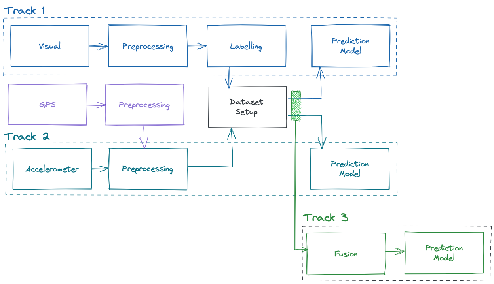

# Detecting Road Surface Anomalies using Multimodal Machine Learning

This repository contains my thesis for the study _Msc. Data Science and Entrepreneurship_ from _Jheronimus Academy of Data Science_ ([website](https://www.jads.nl)). Unfortunately due my NDA I cannot share the data and code developed during this thesis. To this end, this repository only contains the final thesis (with Latex source).

- [Thesis - Detecting Road Surface Anomalies using Multimodal Machine Learning.pdf](./Thesis%20-%20Detecting%20Road%20Surface%20Anomalies%20using%20Multimodal%20Machine%20Learning.pdf)
- [Thesis - Defense Presentation.pdf](./Thesis%20-%20Defense%20Presentation.pdf)

> In Netherlands the current process of performing road maintenance takes long, is costly and largely relies on subjective observations. In recent years, the need for data driven inspection emerged to perform automatic road quality assessment. Research has been performed to build machine learning models to classify models. However, existing work only uses a single source of data. In this work, we contribute a novel method combining both visual and accelerometer data to detect road surface anomalies.
>
> Unfortunately, our dataset was too small to classify actual damages. Instead we resorted to classifying manholes. We created three models to detect manholes. The first model only uses visual data. The second model only uses accelerometer data. The third model uses a combination of both visual and accelerometer data.
>
> Our results indicate that multimodal machine learning is successful in detecting manholes. Although the combination of both data sources does not outperform unimodal models, the approach is an interesting scientific contribution. After training the multimodal model, predictions can be made when only one data source is provided.
>
> For future work, there are interesting opportunities to pursue. For instance, by combining visual and ac- celerometer data enables a model to both localize and describe the impact of a road surface anomaly.

_Different research tracks evaluated during my thesis_
